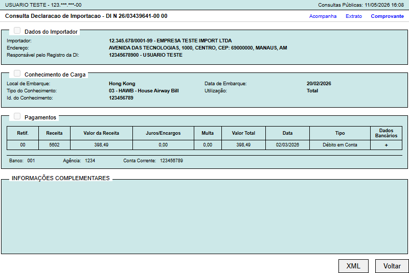

# Sistema de Automação Documental DI

Ferramenta desenvolvida em Python para leitura e processamento de XMLs de Declaração de Importação (DI), com geração automatizada de comprovantes visuais utilizando HTML/CSS + Playwright.

---

## Funcionalidades

* Leitura automática de XMLs DI
* Compatibilidade com múltiplos layouts XML
* Mapeamento e normalização de dados
* Geração automatizada de comprovantes
* Renderização via Chromium/Playwright
* Exportação em imagem
* Interface desktop com Tkinter
* Empacotamento com PyInstaller

---

## Tecnologias utilizadas

* Python
* Playwright
* Tkinter
* HTML
* CSS
* XML Parsing
* PyInstaller

---

## Arquitetura

XML → Parser → Mapeamento → HTML → Renderização → Imagem

---

## Estrutura do Projeto

siscomex-document-render/
├── examples/
├── screenshots/
├── output/
├── di_app.py
├── di_mapeadores.py
├── index.html
├── estilo.css
└── README.md

---

## Screenshots

### Resultado gerado

---

## Como executar

### Instalar dependências

pip install -r requirements.txt

playwright install

### Executar aplicação

python di_app.py

---

## Observações

Os dados exibidos nas imagens e exemplos XML foram anonimizados para preservação de informações corporativas.
